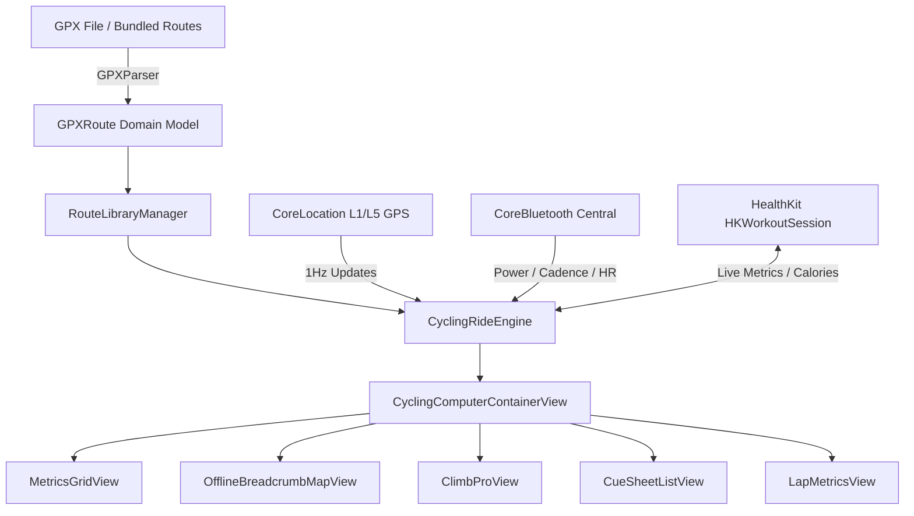

# UltraNav: Apple Watch Ultra Standalone Offline Cycling Computer

<div align="center">
  <h3>Professional Offline Navigation, Live Telemetry & Sensor Computer for Apple Watch Ultra</h3>
  <p>A full-featured, zero-network, standalone replacement for Garmin Edge & Wahoo ELEMNT cycling computers designed natively for watchOS.</p>
</div>

---

## 🚴 Overview

**UltraNav** transforms your **Apple Watch Ultra** into a dedicated, high-performance cycling computer. Engineered specifically for ultra-endurance athletes, gravel grinders, bikepackers, and road cyclists, UltraNav operates **100% offline** without requiring an iPhone or cellular connectivity on the bike.

Leveraging the Apple Watch Ultra's **dual-frequency L1/L5 GPS**, high-precision barometer, 3000-nit display, and physical **Action Button**, UltraNav provides real-time breadcrumb vector navigation, turn-by-turn cue notifications, ClimbPro gradient segmentation, and native CoreBluetooth sensor connectivity.

---

## ✨ Key Features

### 🗺️ 100% Offline Vector Navigation & GPX Engine
- **Streaming GPX Parser**: Fast XML parser supporting track points (`<trkpt>`), elevation, timestamps, and waypoints (`<wpt>`).
- **Autonomous Turn Cue Detection**: Automatic heading delta analysis generates turn-by-turn directions even from basic breadcrumb GPX tracks.
- **Cross-Track Error (XTE)**: Great-Circle navigation math tracks distance from planned course with high precision.
- **Off-Course Alarms**: Instant visual banners and distinct haptic vibrations when deviating >35 meters from route.
- **Standalone Breadcrumb Map**: 60fps vector canvas map with heading arrow, start/finish flags, and turn icons.

### ⛰️ ClimbPro Elevation Profiles
- **Automatic Climb Segmentation**: Detects and categorizes upcoming ascents (Cat 4, Cat 3, Cat 2, Cat 1, and HC).
- **Gradient-Coded Slices**: Color-coded elevation profiles (0-3% Green, 3-6% Yellow, 6-9% Orange, 9%+ Red).
- **Summit Tracker**: Real-time remaining climb distance and vertical meters to summit.

### 📡 Direct CoreBluetooth Sensor Integration
- **Power Meters (`0x1818`)**: Real-time Watts, 3s / 10s smoothed power, Max Power, NP (Normalized Power), and IF.
- **Speed & Cadence (`0x1816`)**: Dual-sensor support with configurable wheel circumference calibration.
- **Heart Rate (`0x180D`)**: External chest straps (Polar H10, Garmin HRM-Pro, Wahoo TICKR) with auto-reconnection.
- **Zone Color Coding**: 5 HR zones and 7 Power training zones with high-contrast color coding.

### ⚡ Apple Watch Ultra Hardware Optimization
- **Sunlight-Readable OLED Grid**: High-contrast, large-format typography designed for readability in direct sunlight.
- **Action Button Laps**: Hardware Action Button trigger for instant manual lap splits and interval recording.
- **Workout Background Runtime**: Integrated with `HKWorkoutSession` & `HKLiveWorkoutBuilder` for continuous background recording and battery efficiency.
- **Complications & Widgets**: Lock screen and watch face widgets for live telemetry and next-turn cues.

---

## 🏗️ Architecture



---

## 🛠️ Tech Stack & Requirements

- **Platform**: watchOS 10.0+ / watchOS 11.0+ (Optimized for Apple Watch Ultra 1 & 2)
- **Language**: Swift 6 (Strict Concurrency & Data Race Safety)
- **Frameworks**: SwiftUI, HealthKit, CoreLocation, CoreBluetooth, WidgetKit, Foundation XML
- **Architecture**: MVVM with Observable State Engines and Clean Layer Separation

---

## 🧪 Testing & Verification

UltraNav includes a full test suite validating all core navigation math, GPX parsing, and engine state transitions:

```bash
# Run unit test suite
xcodebuild -scheme UltraNav \
  -destination 'platform=watchOS Simulator,name=Apple Watch Ultra 2 (49mm)' \
  test -only-testing:UltraNavTests
```

---

## 📄 License

MIT License. Developed for personal and open-source endurance cycling navigation.
