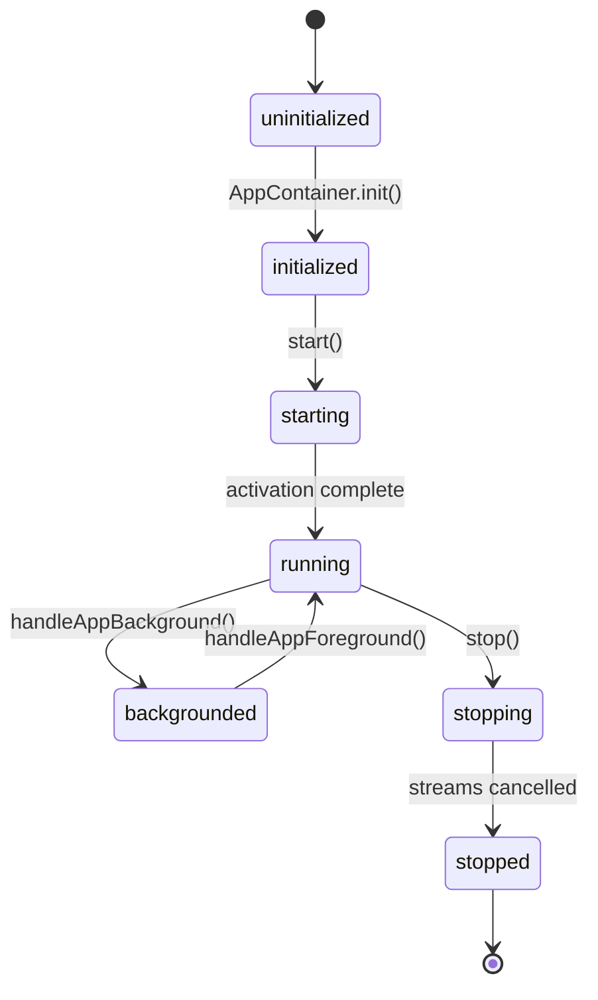

# UltraNav Application Lifecycle & Coordination

## 1. Application Lifecycle States
`AppContainer` and `AppCoordinator` govern the lifecycle transitions of the application:

---

## 2. Coordinated Engine Lifecycle
When user actions or system events alter the ride state, `RideLifecycleCoordinator` ensures atomic, synchronized dispatch across all domain engines:

| Lifecycle Phase | RideEngine | MetricsEngine | NavigationEngine | ClimbEngine |
|---|---|---|---|---|
| **Prepare** | Prepares hardware, checks authorization | Ready for metrics | Ready if route loaded | Ready if route loaded |
| **Start(Date)** | Enters `.active`, starts timers | Enters `.active(at: Date)` | Enters `.navigating` (if route loaded & policy enabled) | Tracks active climbs |
| **Pause(Date)** | Enters `.paused`, stops moving timer | Enters `.paused(at: Date)` | Continues matching or holds state | Holds climb progress |
| **Resume(Date)** | Enters `.active`, resumes moving timer | Enters `.active(at: Date)` | Continues route progression | Continues climb progress |
| **Finish(Date)** | Enters `.completed`, saves workout | Enters `.stopped(at: Date)` | Completes navigation session | Clears active climb |
| **Reset** | Enters `.idle`, resets metrics | Enters `.idle`, clears buffers | Enters `.inactive`, clears route match | Enters `.idle`, clears climbs |

---

## 3. Background Execution & Resource Management
1. **Extended Runtime & Workouts**:
   - When active, `HealthKitService` maintains an `HKWorkoutSession` keeping the watchOS application alive in the background.
2. **Stream Lifecycle Safety**:
   - Every background stream consumer (`AsyncStream`) is bound to a cancelable `Task`.
   - Calling `coordinator.shutdown()` or `appContainer.stop()` immediately cancels all stream tasks, ensuring zero orphaned memory or battery drain.
