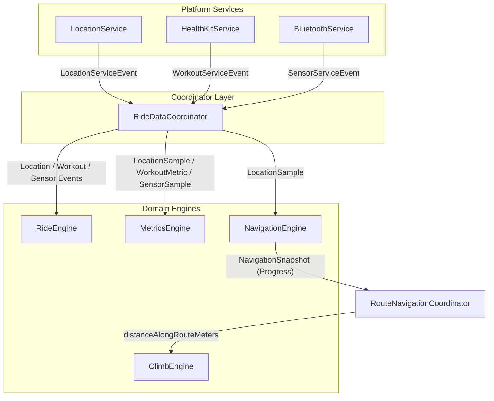
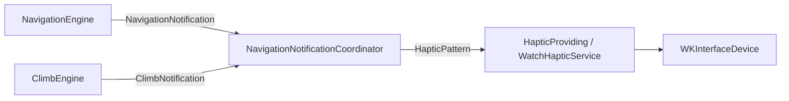

# UltraNav Event Flow & Stream Fan-Out Architecture

## 1. Single Consumer Fan-Out Pattern
Because `AsyncStream` is single-consumer by design, platform services emit a single event stream consumed solely by `RideDataCoordinator`. `RideDataCoordinator` then synchronously and concurrently dispatches domain events to the appropriate engines.

---

## 2. Notification & Haptic Feedback Flow

- **Turn Approaching / Immediate**: Haptic pulse alerts cyclist before and at turns.
- **Off Route / Route Rejoined**: Distinct alert vibrations warn of deviations and confirm rejoining.
- **Climb Events**: Alerts for approaching climb, climb start, and summit reach.
