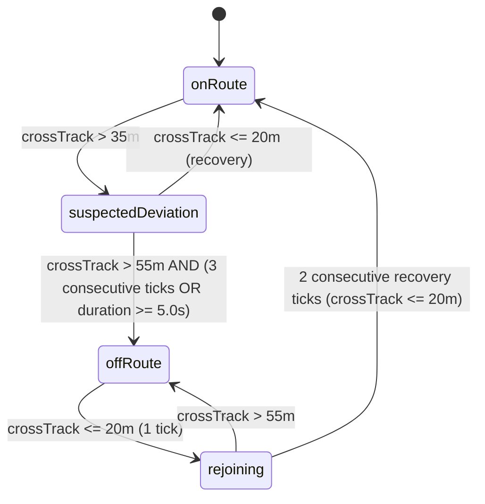

# Off-Route & Rejoin Policy

## 1. Overview
UltraNav Phase 7 establishes a confidence-aware, deterministic off-route detection and rejoin subsystem that prevents noisy false alerts while promptly detecting actual deviations from a loaded GPX course.

---

## 2. Off-Route Detection & Hysteresis State Machine

### Thresholds:
- **Suspected Deviation**: Cross-track distance > `35.0m`.
- **Confirmed Off-Route**: Cross-track distance > `55.0m` with either 3 consecutive off-track samples OR a deviation duration of $\ge 5.0\text{s}$.
- **Recovery / Rejoin Threshold**: Cross-track distance $\le 20.0\text{m}$.
- **Heading Mismatch**: Bearing mismatch $> 90^\circ$ amplifies effective cross-track by 1.5x.

---

## 3. Rejoin Search & Candidate Ranking

When a rider deviates, `RejoinCandidateSearcher` performs bounded candidate discovery:
1. **Locality & Spatial Bounding**: Searches near the last stable progress distance ($[-50\text{m}, +500\text{m}]$) and local spatial radius ($100\text{m}$).
2. **Deterministic Projection**: Projects accepted GPS samples onto geometry edges using `RouteSegmentProjector`.
3. **Multi-Factor Scoring**:
   $$\text{Total Score} = 0.35 \cdot \text{Proximity} + 0.25 \cdot \text{Continuity} + 0.15 \cdot \text{Forward Preference} + 0.15 \cdot \text{Heading} + 0.10 \cdot \text{Persistence}$$
4. **Ambiguity & Conflict Handling**:
   - Loop/Intersection: Two top candidates within $0.15$ score delta representing different route segments ($> 100\text{m}$ apart) are penalized with an ambiguity penalty to prevent incorrect progress jumps.
   - Low Speed: If velocity $< 1.5\text{ m/s}$, heading weights are redistributed to proximity and continuity without penalty.

---

## 4. Rejoin Confirmation & Progress Reconciliation

- **Confirmation Requirement**: Requires 2 consecutive medium/high confidence candidate observations on the same edge or within $30\text{m}$ persistence window before transitioning to `rejoined`.
- **Progress Reconciliation**:
  - **Forward Skip**: Updates current distance along route while preserving the maximum reached distance. Cues and climbs passed during the deviation are reconciled without false duplicate completion alerts.
  - **Backward Rejoin**: Updates current route distance without reducing the maximum recorded distance reached.
  - **Route Completion Safety**: Rejoining near the finish line does not trigger instant route completion until post-rejoin stable match evidence is confirmed.
