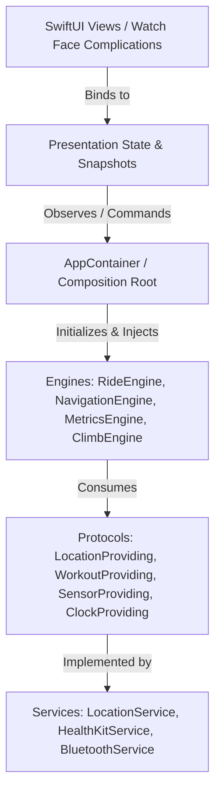

# UltraNav Architecture Guide

**Version:** 1.0.0 (Phase 1 Baseline)  
**Target OS:** watchOS 10.0+ / watchOS 11.0+ (Apple Watch Ultra Standalone)  
**Concurrency Model:** Swift 6 Strict Concurrency & Sendable Isolation

---

## 1. Architectural Principles

UltraNav follows a strict layered architecture with unidirectional dependency flow:

### Golden Rule of Dependencies
**Dependencies point downward only, never upward or circular.**
- Domain models (`Coordinate`, `LocationSample`, `RideState`, `RideSnapshot`, `NavigationSnapshot`, `RideMetrics`) MUST NOT import `SwiftUI`, `HealthKit`, `CoreBluetooth`, or `WidgetKit`.
- Calculation engines (`NavigationEngine`, `MetricsEngine`, `ClimbEngine`) MUST NOT import `SwiftUI` or manage hardware SDK instances directly.
- Views MUST NOT interact with `CLLocationManager`, `CBCentralManager`, or `HKHealthStore` directly. Views strictly consume formatted snapshots.

---

## 2. Layer Definitions

### 1. Domain Layer (`UltraNav/Domain/`)
- Pure Swift, platform-independent, Sendable data structures.
- **`Ride/`**: `RideState` (Finite state machine), `RideSnapshot`, `RideFailure`.
- **`Navigation/`**: `Coordinate` (Haversine math), `LocationSample`, `NavigationState`, `NavigationSnapshot`.
- **`Metrics/`**: `RideMetrics` (Speed, Cadence, Power, HR, Laps, NP, IF).
- **`Climb/`**: `ClimbSnapshot` (Elevation, Grade %, VAM, Climb segments).

### 2. Service Protocol Abstraction Layer (`UltraNav/Services/Protocols/`)
- Testable protocol interfaces abstracting system hardware:
  - `LocationProviding` & `LocationServiceDelegate`
  - `WorkoutProviding`
  - `SensorProviding`
  - `ClockProviding` (Deterministic time for unit testing)

### 3. Engine Layer (`UltraNav/Engines/`)
- **`RideEngine`**: Coordinates ride lifecycle state transitions, hardware start/stop, timer ticks, and snapshot publishing.
- **`NavigationEngine`**: Manages active route tracking, Cross-Track Error (XTE), off-course detection, and turn cues.
- **`MetricsEngine`**: Aggregates speed, distance, moving time, power smoothing, and lap triggers.
- **`ClimbEngine`**: Computes elevation gain, rolling grade percent, VAM, and active climb progress.

### 4. Application Composition Root (`UltraNav/App/`)
- `AppContainer`: Instantiates and injects all services and engines without relying on global singletons. Enables unit testing with fake hardware doubles (`FakeLocationService`, `FakeWorkoutService`, `FakeSensorService`, `TestClock`).

---

## 3. Concurrency & Isolation Policy

1. **`@MainActor` Isolation**: UI-facing observable classes (`RideEngine`, `AppContainer`, `NavigationEngine`, `MetricsEngine`, `ClimbEngine`) are isolated to `@MainActor` to guarantee glitch-free 60fps SwiftUI rendering.
2. **`Sendable` Domain Models**: All snapshot models and domain structs conform to `Sendable`, allowing safe asynchronous transport across background tasks and notification queues.
3. **No `@unchecked Sendable` Shortcuts**: Thread safety is achieved through actor isolation, value semantics, and explicit protocols.