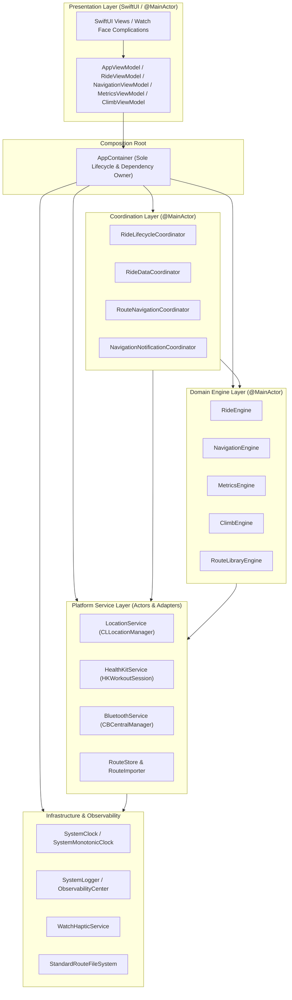

# UltraNav System Architecture Specification

**Version**: 1.0.0 (Phase 1 Canonical Architecture Lock-In)  
**Target Platform**: watchOS 10.0+ / watchOS 11.0+ (Apple Watch Ultra Standalone)  
**Concurrency Standard**: Swift 6 Strict Concurrency & Actor Isolation  

---

## 1. Architectural Philosophy & Unidirectional Data Flow

UltraNav is designed as an offline-first, high-precision cycling computer running natively on Apple Watch Ultra. The architecture strictly enforces a unidirectional data flow and single-ownership composition hierarchy.

---

## 2. Core Architectural Rules

1. **Zero Global Singletons**: No `.shared` instances exist in the domain, calculation, coordinator, or presentation layers. `AppContainer` is the sole owner of the lifecycle and dependency graph.
2. **Downward-Only Dependencies**: High-level modules depend on lower-level abstractions (DIP). Lower levels never reference higher levels.
3. **Pure Value Snapshots**: Communication across layers occurs via immutable, Sendable value snapshots (`RideSnapshot`, `NavigationSnapshot`, `MetricsSnapshot`, `ClimbSnapshot`, `RouteLibrarySnapshot`).
4. **Strict Actor Isolation**: 
   - All presentation view models, coordinators, and engines are isolated to `@MainActor`.
   - Hardware I/O and heavy computational tasks (GPX normalization, climb detection profile building) are isolated to dedicated background actors (`ClimbAnalysisService`, `RouteStore`, `RouteImporter`).
5. **Hermetic Testability**: Every service, engine, coordinator, and time source is backed by a protocol, allowing 100% deterministic testing using test doubles and monotonic virtual clocks without invoking Apple Watch hardware.

---

## 3. Subsystem Breakdown

### 3.1 Platform Services (`UltraNav/Services/`)
- **`LocationService`**: Implements `LocationProviding`. Adapts CoreLocation updates into a typed `AsyncStream<LocationServiceEvent>`. Enforces dead reckoning and accuracy thresholds.
- **`HealthKitService`**: Implements `WorkoutProviding`. Manages `HKWorkoutSession` lifecycle and collects physiological telemetry.
- **`BluetoothService`**: Implements `SensorProviding`. Discovers, connects, and parses standard Bluetooth GATT cycling profiles (Cycling Power, Speed/Cadence, Heart Rate).
- **`RouteStore` & `RouteImporter`**: Manages secure on-disk persistence of JSON routes and transactional importing/parsing of GPX files.

### 3.2 Domain Engines (`UltraNav/Engines/`)
- **`RideEngine`**: Manages the formal ride state machine (`unconfigured` → `idle` → `preparing` → `recording` → `paused` → `finished`). Synchronizes hardware session startup.
- **`NavigationEngine`**: Manages route match progression, cross-track error (XTE), turn cue advancement, and off-route hysteresis.
- **`MetricsEngine`**: Aggregates multi-source telemetry, computes rolling averages (3s/10s/30s power, 5s speed), max values, total energy, and elevation gain.
- **`ClimbEngine`**: Analyzes elevation profiles, classifies climbs into UCI categories (HC, Cat 1–4), and calculates live climb progress, grade %, and VAM.
- **`RouteLibraryEngine`**: Manages route selection, deletion, and import status transitions.

### 3.3 Coordinators (`UltraNav/Coordinators/`)
- **`RideLifecycleCoordinator`**: Coordinates cross-engine lifecycle transitions (e.g., starting metrics and navigation engines when a ride begins).
- **`RideDataCoordinator`**: Fans out location, workout, and sensor event streams to appropriate domain consumers.
- **`RouteNavigationCoordinator`**: Orchestrates route loading from disk into `NavigationEngine` and `ClimbEngine`.
- **`NavigationNotificationCoordinator`**: Evaluates engine notification channels and triggers distinctive watchOS haptics.

### 3.4 Presentation Layer (`UltraNav/Presentation/`)
- **`AppViewModel`**: Top-level UI state coordinator.
- **`RideViewModel`**, **`NavigationViewModel`**, **`MetricsViewModel`**, **`ClimbViewModel`**, **`RouteLibraryViewModel`**: Observation-backed view models that consume engine snapshots through pure view state mappers (`RideViewStateMapper`, `NavigationViewStateMapper`, etc.).

---

## 4. Observability & Fault Isolation

- **`ObservabilityCenter`**: Central diagnostic dispatcher recording operational traces, state transitions, subsystem health, and categorized failures.
- **`FailureRecorder`**: Bounded actor maintaining a 100-record circular buffer for flight recorder post-mortems with strict PII masking.
- **`RecoveryCoordinator`**: Enforces automated degraded-mode operation (e.g., continuing sensor-based metrics recording if GPS accuracy degrades).